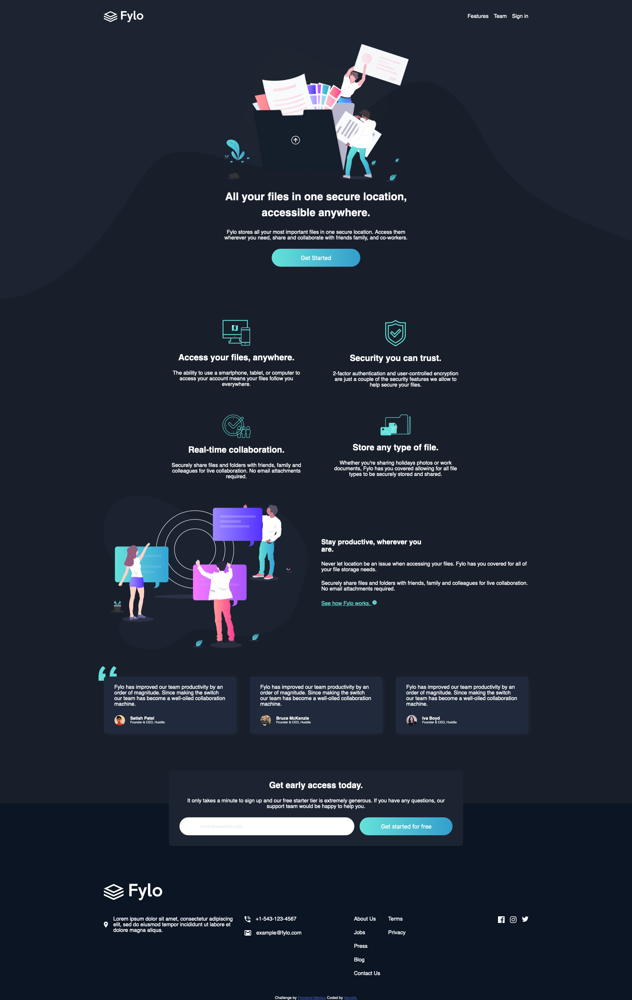

# Frontend Mentor - Fylo dark theme landing page solution

This is a solution to the [Fylo dark theme landing page challenge on Frontend Mentor](https://www.frontendmentor.io/challenges/fylo-dark-theme-landing-page-5ca5f2d21e82137ec91a50fd). Frontend Mentor challenges help you improve your coding skills by building realistic projects.

## Table of contents

- [Overview](#overview)
  - [The challenge](#the-challenge)
  - [Screenshot](#screenshot)
  - [Links](#links)
- [My process](#my-process)
  - [Built with](#built-with)

## Overview

### The challenge

Users should be able to:

- View the optimal layout depending on their device's screen size
- See hover states for interactive elements

### Screenshot

### Links

- Solution URL: [Solution here](https://github.com/VarodA/fem-Fylo-dark-theme-landing-page)
- Live Site URL: [Live site here](https://varoda.github.io/fem-Fylo-dark-theme-landing-page/)

## My process

### Built with

- Semantic HTML5 markup
- CSS custom properties
- SCSS
- Grid
- Flexbox
- Mobile-first workflow
- Parcel
